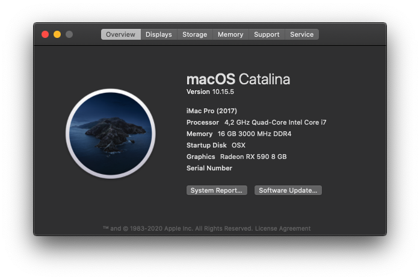
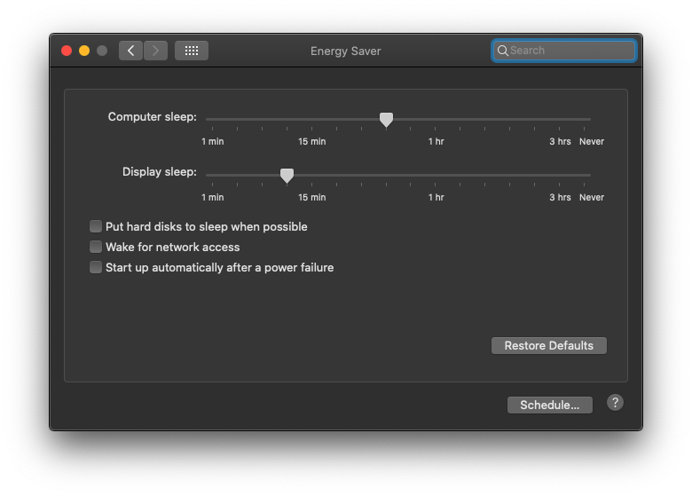
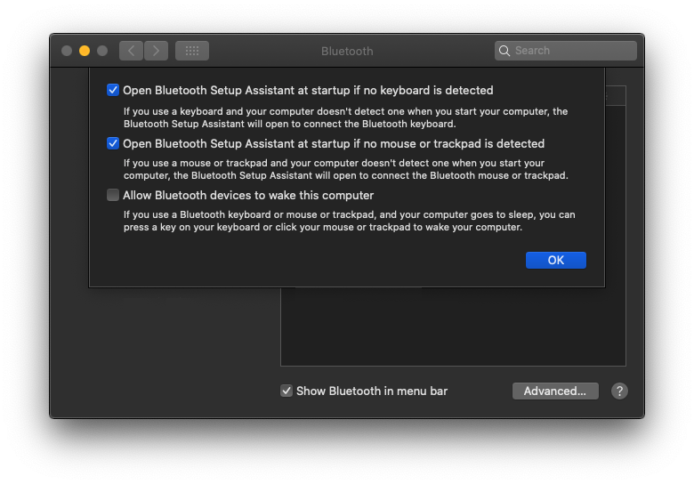

# Hackintosh-PC

## Catalina 10.15.5

## PC Specs:
- Processor: [Intel I7-7700K](https://ark.intel.com/content/www/es/es/ark/products/97129/intel-core-i7-7700k-processor-8m-cache-up-to-4-50-ghz.html)
- Motherboard: [Gigabyte Z270N - Gaming 5](https://www.gigabyte.com/us/Motherboard/GA-Z270N-Gaming-5-rev-10#kf)
- Memory: [16gb Corsair 3000 DDR4](https://www.corsair.com/es/es/Categor%C3%ADas/Productos/Memoria/VENGEANCE%C2%AE-RGB-16GB-(2-x-8GB)-DDR4-DRAM-3000MHz-C15-Memory-Kit/p/CMR16GX4M2C3000C15)
- GPU: [AMD Radeon RX 590](https://www.amd.com/es/products/graphics/radeon-rx-590)

## Perfectly Working Features:

- Audio
- Full keyboard working (Using "ES-PC" input sources)
- Keyboard backight control
- Volumen Keyboards
- Num keys
- USB 3.0
- Sleep
- Siri
- AirDrop
- HDMI audio
- Wifi and Bluetooth: Using this card and adaptor (Sodial Bcm94360Cs2 - Adaptator BCM94360CS2 BCM943224PCIEBT2 A M2 (M.2 NGFF) A E Key)

## Not Working:

- IMessage and FaceTime (I will try to fix it in the next days)

## Clover:
- Version 5119    
 
## Kexts:
- AppleALC
- AtherosE2200Ethernet
- HDMIAudio
- IntelMausiEthernet
- RealtekRTL8111
- Lilu
- SMCProcessor
- SMCSuperIO
- USBPorts (made for this notebook using Hackintool)
- XHCI-200-series-injector
- WhateverGreen

## Drivers:
- ApfsDriverLoader
- AptioMemoryFix
- AudioDxe
- DataHubDxe
- FSInject
- HFSPlus
- VirtualSmc

## Configs:

It's important to disable "Wake for Wi-Fi network access to avoid wifi problems"

It's important to disable "Allow Bluetooth devices to wake this computer"

## Credits

- [Acidanthera](https://github.com/acidanthera)
  - [AppleALC](https://github.com/acidanthera/AppleALC)
  - [Lilu](https://github.com/acidanthera/Lilu)
  - [VirtualSMC](https://github.com/acidanthera/VirtualSMC)
  - [WhateverGreen](https://github.com/acidanthera/WhateverGreen)
- [RehabMan](https://github.com/RehabMan)
- [VoodooI2C Developer Team](https://voodooi2c.github.io/#Credits%20and%20Acknowledgments/Credits%20and%20Acknowledgments)
